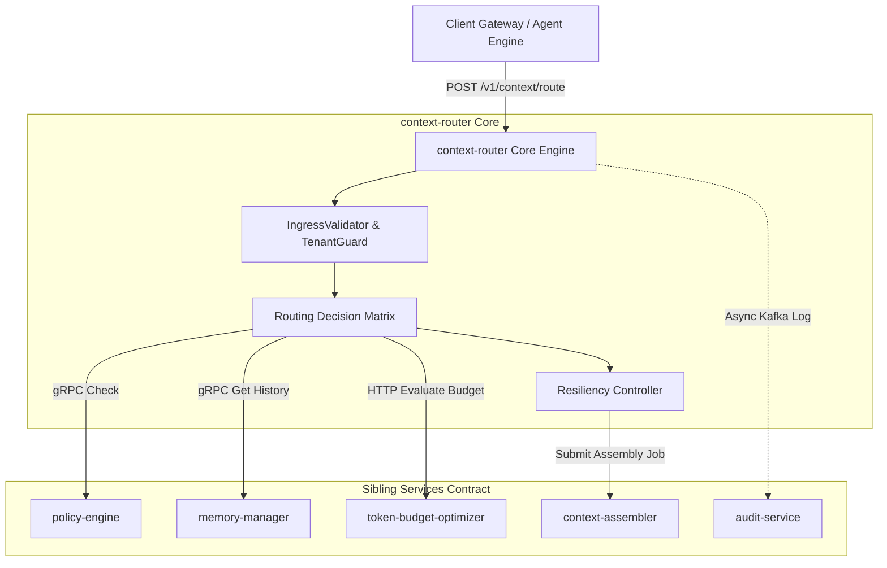

<div align="center">

# Context Router (`context-router`)

> **Enterprise Context Engineering Platform — High-Performance Context & Model Router**

[](https://github.com/Devopstrio/context-router/actions/workflows/ci.yaml)
[](https://github.com/Devopstrio/context-router)
[](https://github.com/Devopstrio/context-router)
[](https://github.com/Devopstrio/context-router)
[](https://github.com/Devopstrio/context-router)
[](https://github.com/Devopstrio/context-router/blob/main/LICENSE)

[Architecture Specification](docs/architecture/overview.md) • [API Documentation](docs/api/endpoints.md) • [Security Model](docs/security/security-model.md) • [Deployment Guide](deployment/kubernetes/README.md)

</div>

---

`context-router` is the enterprise-grade context orchestration, model matching, and dispatch control plane for high-scale Enterprise AI platforms handling millions of daily inference requests. It acts as the intelligent routing traffic controller within the Enterprise Context Engineering ecosystem, ensuring low-latency, cost-optimized, and strictly isolated context delivery to Foundational Models (LLMs/SLMs).

---

## 🏛 Document Architecture Map

This repository serves as the authoritative, implementation-ready engineering blueprint and production codebase for `context-router`.

```
context-router/
├── README.md                           # Main Architecture Portal & Quick Start
├── pyproject.toml                      # Python Dependencies & Package Manifest
├── Dockerfile                          # Multi-Stage Production Container Specification
├── docker-compose.yml                  # Local Dev & Integration Environment
├── .github/workflows/ci.yaml           # GitHub Actions CI/CD Pipeline
├── src/context_router/                 # Core Python Application Source
│   ├── api/                            # REST Routes & Probes (/v1/context/route, /health)
│   ├── cache/                          # Dual-Tier Cache (L1 Memory TTL + L2 Redis Cluster)
│   ├── config/                         # Settings & Dynamic Model Capabilities Registry
│   ├── contracts/                      # Sibling Microservice Integration Clients
│   ├── observability/                  # Prometheus Metrics, OpenTelemetry Tracing & Logging
│   ├── resiliency/                     # Circuit Breaker & Fallback Controller
│   ├── routing/                        # Routing Decision Matrix, Rule Engine & State Machine
│   ├── security/                       # JWT Authentication & TenantIsolationGuard
│   └── validation/                     # OpenAPI 3.1 Pydantic Schemas & RFC 7807 Error Handlers
├── deployment/                         # IaC Infrastructure Declarations
│   ├── kubernetes/                     # Base Kustomize & Dev/Staging/Prod Overlays
│   └── terraform/                      # Multi-Cloud Terraform Blueprints
├── docs/                               # Architecture Specifications & Diagrams
├── schemas/                            # Strict Data Validation Schemas
└── tests/                              # Unit, Integration, & API Test Suite (>90% Coverage)
```

---

## 🔑 Core Architecture Principles

1. **Deterministic Sub-12ms Latency (P99.9):** High-efficiency execution path utilizing dual-tier caching (L1 In-Memory TTL + L2 Redis Cluster) and non-blocking asynchronous event emission.
2. **Zero-Trust Tenant Boundaries:** Strict cryptographic context tagging (`TenantID` + `SessionID`) verified at every module boundary to eliminate cross-tenant data leaks.
3. **Dynamic Provider Resiliency:** Real-time circuit breaker health tracking with automatic dynamic failover to secondary provider regions during rate limiting (HTTP 429) or endpoint degradation.
4. **Decoupled Architecture:** Strict separation of responsibilities. `context-router` executes decision logic and context dispatching; physical prompt assembly, token truncation, and vector fetches are delegated to specialized sibling repositories via gRPC/REST.

---

## 🛠 High-Level Repository Architecture Diagram



---

## 🚀 Quick Start & Local Execution

### 1. Installation & Environment Setup

```bash
# Clone repository
git clone https://github.com/Devopstrio/context-router.git
cd context-router

# Create virtual environment & install dependencies
python -m venv .venv
source .venv/bin/activate  # On Windows: .venv\Scripts\activate
pip install -e ".[dev]"
```

### 2. Running Quality Checks & Test Suite

```bash
# Linting & Formatting
ruff check .

# Type Checking
mypy .

# Security Scan
bandit -r src/ -ll -ii

# Unit & Integration Tests with Coverage
pytest --cov=src/context_router --cov-report=term-missing
```

### 3. Launching Service Locally

```bash
# Start with Uvicorn dev server
uvicorn context_router.main:app --host 127.0.0.1 --port 8080 --reload
```

---

<div align="center">

## 📄 License & Governance

Restricted Internal Enterprise Standard. Designed for Fortune 500 deployments.  
Built with ❤️ by [Devopstrio Engineering](https://github.com/Devopstrio). All rights reserved.

</div>