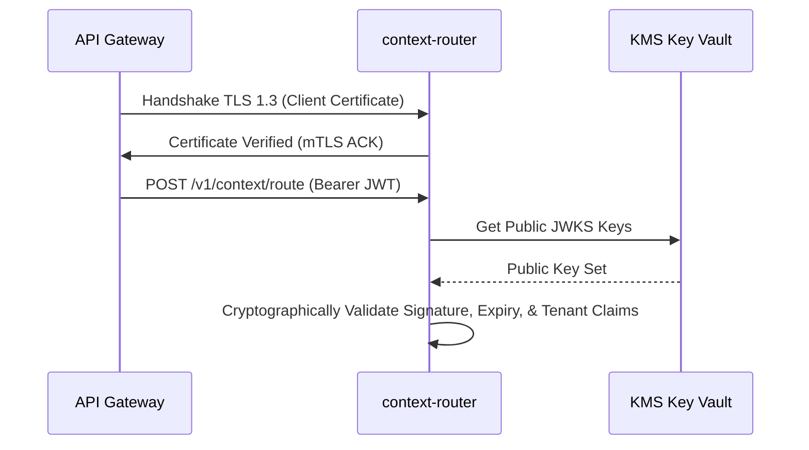

# Authentication & Authorization Specification

## 1. Zero-Trust Security Strategy
`context-router` mandates two-way mutual TLS (mTLS) for all transport connections and OAuth 2.0 JWT validation for request level context identification.



## 2. JWT Claims Schema
```json
{
  "iss": "https://auth.enterprise.internal",
  "sub": "service-agent-01",
  "aud": "context-router-api",
  "exp": 1785945600,
  "iat": 1785942000,
  "tenant_id": "tenant-corp-alpha",
  "roles": ["context:route", "session:read"],
  "data_residency": ["EU", "US"]
}
```