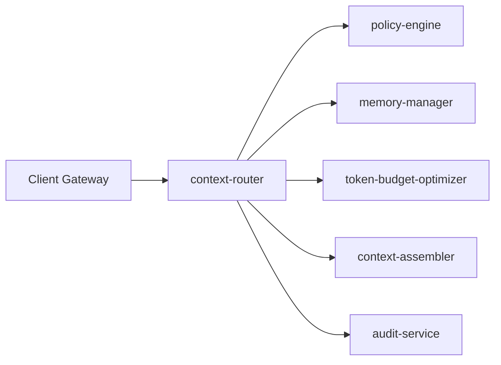

# Architecture Overview: `context-router`

## 1. System Topology
`context-router` sits at the center of the Enterprise Context Engineering ecosystem as a low-latency, high-throughput routing control plane. It intercepts AI request metadata, evaluates cost, compliance, and latency policies, orchestrates pre-inference context collection, and dispatches an execution plan to `context-assembler`.

## 2. Core Operational Flow
1. **Ingress & Authentication:** Client presents JWT bearer tokens and payload with session/tenant tags.
2. **Tenant Isolation Verification:** `TenantIsolationGuard` validates authorization against tenant scopes in L1 cache / `policy-engine`.
3. **Session State Lookup:** Query sent to `memory-manager` to establish historical context depth and token mass.
4. **Token & Model Evaluation:** Payload mass evaluated against target model context windows via `token-budget-optimizer`.
5. **Route Calculation:** `RouteDecisionMatrix` evaluates cost, latency SLAs, regional compliance rules, and provider availability scores.
6. **Execution Dispatch:** Final context route specification dispatched to `context-assembler` for physical execution.
7. **Audit Emission:** Immutable event asynchronously pushed to Kafka for `audit-service`.

## 3. SLA & Performance Matrix
* **Target Throughput:** 50,000 requests per second across distributed regional clusters.
* **P95 Latency Target:** $< 5\text{ms}$
* **P99.9 Latency Target:** $< 12\text{ms}$
* **Target Availability:** 99.999% uptime (High-Availability active-active deployment).