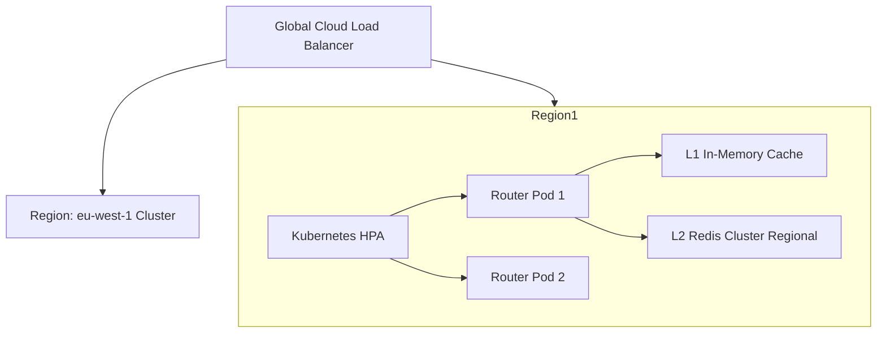

# Scalability & High-Availability Architecture

## 1. Horizontal Scaling Model
`context-router` is designed as a stateless microservice running on Kubernetes. Pods scale horizontally based on custom CPU, memory, and RPS metrics using Kubernetes Horizontal Pod Autoscaler (HPA).

## 2. Stateless Processing Principles
* Zero session state stored in local instance memory across HTTP requests.
* Dynamic configuration and model matrices cached locally in L1 (5s TTL) and synchronized via Redis Pub/Sub.
* Stateless execution enables instant pod startup and seamless autoscaling during traffic spikes.

## 3. Disaster Recovery & Multi-Region Topology
* **Active-Active Deployment:** Deployed across minimum 3 Availability Zones across multiple cloud regions (e.g., `us-east-1`, `eu-west-1`).
* **Regional Isolation:** Global LB automatically routes client traffic to the nearest healthy region.
* **Cross-Region Failover:** If an entire cloud region degrades, DNS level health checks reroute traffic within $< 3\text{s}$.