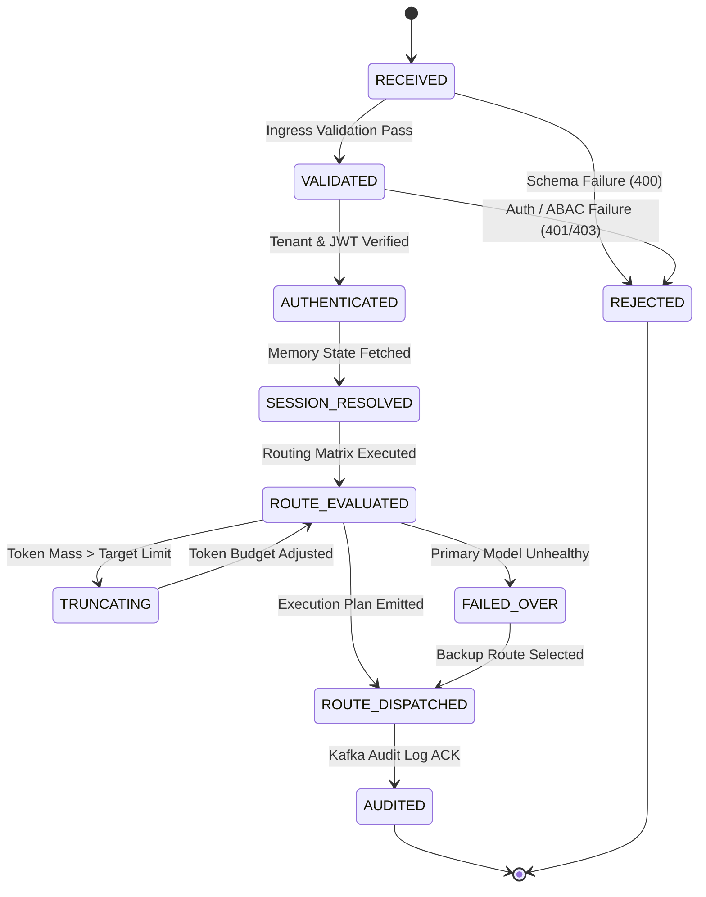

# Request State Machine Specification

Every context routing request progresses through a deterministic state transition lifecycle.

## State Definitions
* **`RECEIVED`**: Ingress payload accepted at API gateway layer.
* **`VALIDATED`**: Structural JSON schema and input constraints verified.
* **`AUTHENTICATED`**: JWT token claims and tenant isolation boundaries validated.
* **`SESSION_RESOLVED`**: Conversation history pointers loaded from `memory-manager`.
* **`ROUTE_EVALUATED`**: Decision algorithm selected target model and fallback hierarchy.
* **`TRUNCATING`**: Request delegated to `token-budget-optimizer` due to token overflow.
* **`FAILED_OVER`**: Circuit breaker triggered; fallback model target selected.
* **`ROUTE_DISPATCHED`**: Plan sent to `context-assembler`.
* **`AUDITED`**: Telemetry event published to `audit-service`.