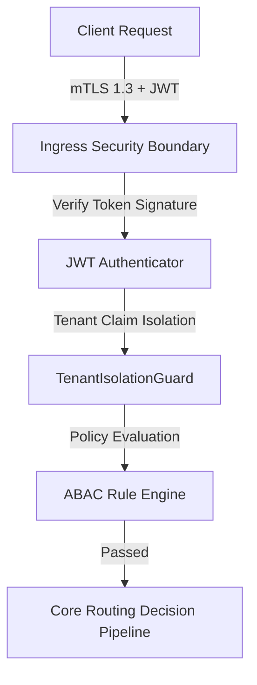

# Zero-Trust Security Architecture Model

`context-router` operates under a strict Zero-Trust security posture. No internal network connection or calling service is trusted by default.

```mermaid
graph TD
    User[Client Request] -->|mTLS 1.3 + JWT| Ingress[Ingress Security Boundary]
    Ingress -->|Verify Token Signature| Auth[JWT Authenticator]
    Auth -->|Tenant Claim Isolation| Guard[TenantIsolationGuard]
    Guard -->|Policy Evaluation| ABAC[ABAC Rule Engine]
    ABAC -->|Passed| Core[Core Routing Decision Pipeline]
```